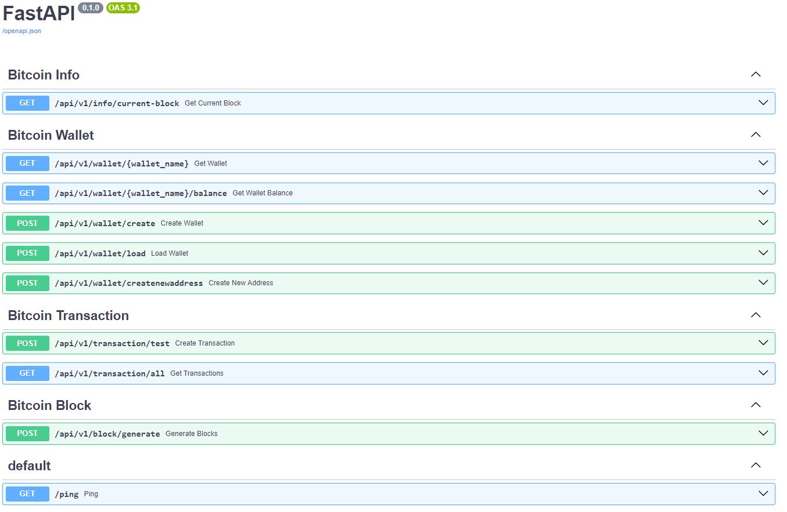

# bitcoin-core-node-app

FastAPI REST API service for retrievin blockchain information and transaction operations using Bitcoin Core node (regtest)
You can use openapi(swagger) to call end-points `http://localhost:8000/docs`.

## Prerequisites

- Python 3.12
- Docker
- Docker-compose

## Setup

### Dockerized local run

If you want to start system with docker then:

- Create .env file from .env.template with the same settings (or your own)

- Run `docker-compose -f docker-compose.yaml up -d --build` in root of project

It will setup dockerized installation of postgres-db, bitcoin-regtest and backend to start dev server accesslible via `http://localhost:8000/`

## Migrations

### Applying all migrations

Run a command:

In container `alembic upgrade head` in "backend/app/" folder.
If locally then first install all dependencies in the "backend/" folder using `poetry update`

### Additional alembic command

In backend/app/alembic/README

## Bitcoin Adapter

Bitcoin adapter allows you to connect with Bitcoin node (regtest/testnet) using BitcoinRPC lib
